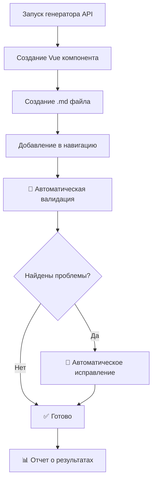

# 🤖 Система автоматической валидации навигации

## ✅ Что создано

Создана полноценная система автоматической проверки и исправления навигации API после создания или редактирования.

## 📁 Файлы системы

### 1. `navigation-validator.cjs` - Основной валидатор
**Возможности:**
- ✅ Проверка синтаксиса конфигурации
- ✅ Обнаружение дубликатов API
- ✅ Проверка правильного порядка API
- ✅ Валидация существования файлов
- ✅ Автоматическое исправление навигации
- ✅ Детальные отчеты о проблемах

### 2. `universal-swagger-generator-final.cjs` - Обновленный генератор
**Новые возможности:**
- ✅ Автоматический запуск валидации после создания API
- ✅ Автоматическое исправление обнаруженных проблем
- ✅ Интеграция с системой валидации

### 3. `test-auto-validation.js` - Тестовый скрипт
- ✅ Тестирование автоматической валидации
- ✅ Демонстрация работы системы

## 🚀 Использование

### Автоматическая валидация
```bash
# При генерации любого API валидация запускается автоматически
node -e "
const { UniversalAPIGenerator } = require('./universal-swagger-generator-final.cjs');
const generator = new UniversalAPIGenerator();
generator.generateAPI('New API', endpoints, 'InteractiveNewAPI');
// ↑ Автоматически запустит валидацию и исправление
"
```

### Ручная валидация
```bash
# Детальный отчет о состоянии навигации
node navigation-validator.cjs --validate
node navigation-validator.cjs -v

# Автоматическое исправление проблем
node navigation-validator.cjs --fix
node navigation-validator.cjs -f
```

### Тестирование системы
```bash
# Протестировать автоматическую валидацию
node test-auto-validation.js
```

## 🔧 Что проверяется и исправляется

### 1. **Синтаксические ошибки**
- ❌ Несбалансированные скобки `{}` и `[]`
- ❌ Лишние запятые в конце объектов
- ✅ Автоматическое исправление

### 2. **Дубликаты API**
- ❌ Одинаковые API в навигации несколько раз
- ✅ Удаление дубликатов, сохранение последней (полной) версии

### 3. **Порядок API**
- ❌ Неправильный порядок API в навигации
- ✅ Автоматическая сортировка по ожидаемому порядку:
  1. Overview
  2. User API
  3. Spot Trading API
  4. Authentication API
  5. Wallet API
  6. KYC API

### 4. **Существование файлов**
- ❌ Отсутствующие `.md` файлы
- ❌ Отсутствующие `.vue` компоненты
- ⚠️ Предупреждения о несуществующих файлах

## 📊 Пример отчета валидации

```
🧭 Navigation Validation Report
==================================================
📊 Summary:
   - Total APIs: 6
   - Duplicates: 2
   - Order issues: 1
   - File issues: 0
   - Syntax issues: 0
   
📋 Current API Structure:
   1. Overview ✅
   2. User API ✅
   3. Authentication API ❌ [DUPLICATE, WRONG_ORDER]
   4. Spot Trading API ✅
   5. Authentication API ❌ [DUPLICATE]
   6. Wallet API ✅

❌ Issues found! Run fixNavigation() to auto-fix.
```

## 🎯 Алгоритм исправления

### 1. **Удаление дубликатов**
- Создает Map уникальных API по названию
- Сохраняет последнюю версию (обычно более полную)
- Удаляет все предыдущие копии

### 2. **Сортировка по порядку**
- Сортирует API согласно `expectedApiOrder`
- Неизвестные API помещает в конец
- Сохраняет структуру sub-items

### 3. **Генерация правильной структуры**
- Создает корректный объект навигации
- Применяет единый стиль форматирования
- Сохраняет все endpoints и ссылки

## ⚡ Преимущества

### **Для разработчика:**
- ✅ **Никаких ручных исправлений** - все автоматически
- ✅ **Мгновенное обнаружение проблем** после генерации
- ✅ **Предотвращение ошибок сборки** VitePress
- ✅ **Единообразная структура** навигации

### **Для проекта:**
- ✅ **Стабильная навигация** без дубликатов
- ✅ **Правильный порядок API** всегда
- ✅ **Автоматическое тестирование** навигации
- ✅ **Предотвращение багов** в продакшене

## 🔄 Workflow генерации API



## 🎉 Результат

**Навигация всегда будет:**
- ✅ Без дубликатов
- ✅ В правильном порядке  
- ✅ С корректным синтаксисом
- ✅ Единообразно отформатирована

**Больше никаких ручных исправлений навигации!** 🚀 