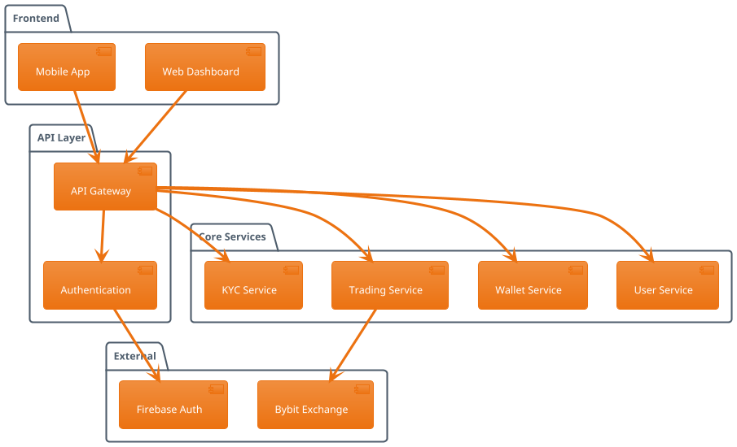

# System Architecture

OKD Finance is built on modern microservices architecture with external exchange integrations.

## Architecture Overview

## Key Components

### API Gateway
- Single entry point
- Request routing
- Authentication
- Rate limiting

### Core Services
- **User Service**: Account management
- **Wallet Service**: Balance and transactions
- **Trading Service**: Order execution
- **KYC Service**: Identity verification

### External Integrations
- **Bybit**: Trading execution
- **Firebase**: Authentication
- **Payment Processors**: Fiat operations 