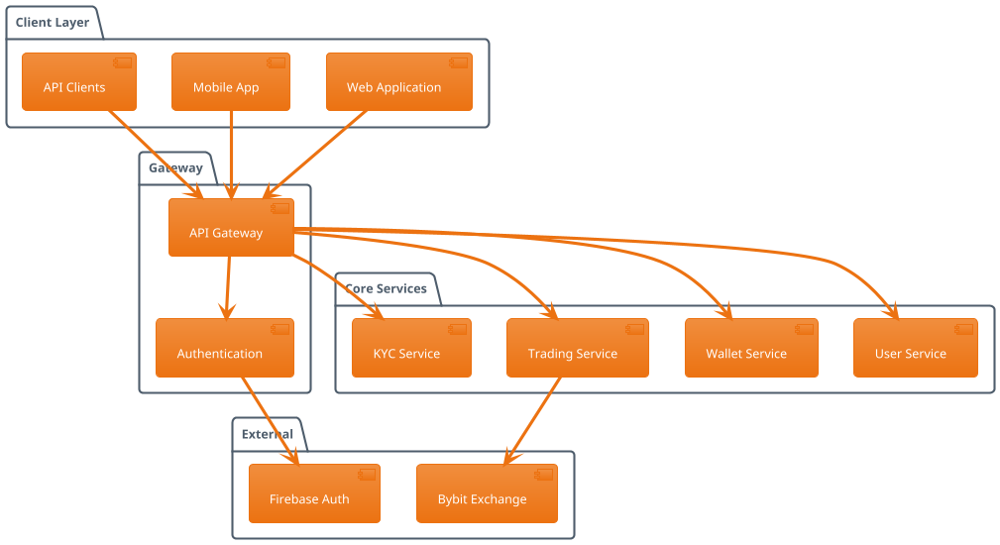

# Introduction

Welcome to OKD Finance - a comprehensive cryptocurrency exchange platform with integrated trading and financial services.

## What is OKD Finance?

OKD Finance is a modern cryptocurrency exchange platform that provides:

- **Spot & Futures Trading** with Bybit integration
- **Multi-currency Wallets** with advanced security
- **KYC/AML Compliance** for regulatory requirements  
- **Developer-friendly APIs** for custom integrations
- **Real-time Market Data** and analytics

## Key Features

### 🔒 Security First
- Firebase Authentication
- JWT token security
- Multi-factor authentication
- Cold storage for assets

### 🚀 High Performance
- Low-latency trading engine
- Real-time WebSocket data
- 99.9% uptime guarantee
- Scalable architecture

### 🌍 Global Access
- Multi-language support
- 24/7 customer service
- Regulatory compliance
- Mobile-first design

### 🔌 Developer Tools
- RESTful API
- WebSocket streams
- Comprehensive documentation
- SDKs and libraries

## System Architecture

## Getting Started

1. **[Quick Start Guide](/en/guide/quick-start)** - Set up your account in minutes
2. **[API Overview](/en/api/overview)** - Integrate with our APIs
3. **[Trading Guide](/en/trading/overview)** - Start trading cryptocurrencies
4. **[Bybit Integration](/en/bybit/overview)** - Connect with Bybit exchange

## Support

- **Documentation:** This site
- **API Reference:** Interactive Swagger docs
- **Community:** Discord & Telegram
- **Support:** 24/7 live chat 