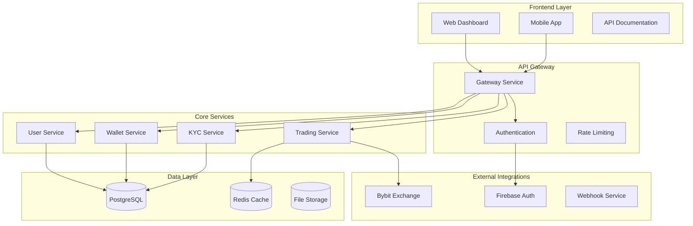

# Архитектура системы

OKD Finance построен на современной микросервисной архитектуре с интеграцией внешних торговых платформ.

## Компоненты системы

## Архитектурные принципы

### Микросервисы
- Каждый сервис независим
- API-first подход
- Горизонтальное масштабирование

### Безопасность
- JWT токены
- Firebase Authentication
- Rate limiting
- HTTPS везде

### Надежность
- Circuit breakers
- Retry механизмы
- Health checks
- Monitoring

## Сервисы

### Gateway Service
- Единая точка входа
- Роутинг запросов
- Аутентификация
- Rate limiting

### User Service
- Управление пользователями
- Профили и настройки
- Сессии

### Wallet Service
- Управление кошельками
- Балансы
- Транзакции

### Trading Service
- Исполнение ордеров
- Интеграция с Bybit
- Управление позициями

### KYC Service
- Верификация документов
- Compliance
- Risk management

## Интеграции

### Bybit Exchange
- Spot и Futures торговля
- Real-time данные
- Order management
- Portfolio sync

### Firebase Auth
- Социальная аутентификация
- Multi-factor auth
- User management

## Мониторинг

- Application metrics
- Error tracking  
- Performance monitoring
- Business metrics 