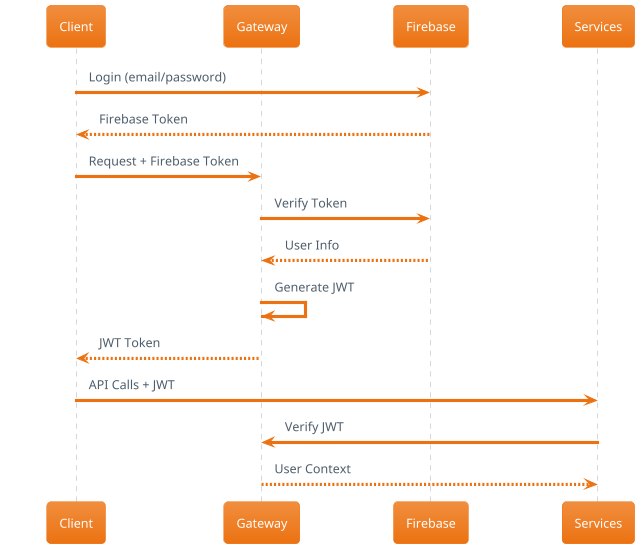

# Аутентификация

Система аутентификации OKD Finance основана на Firebase Auth и JWT токенах.

## Схема аутентификации



## Firebase Authentication

### Поддерживаемые методы
- Email/Password
- Google OAuth
- Apple Sign In
- Phone Number
- Anonymous Auth

### Настройка Firebase
```javascript
import { initializeApp } from 'firebase/app';
import { getAuth } from 'firebase/auth';

const firebaseConfig = {
  apiKey: "your-api-key",
  authDomain: "okd-finance.firebaseapp.com",
  projectId: "okd-finance"
};

const app = initializeApp(firebaseConfig);
export const auth = getAuth(app);
``` -->

### Регистрация пользователя
```javascript
import { createUserWithEmailAndPassword } from 'firebase/auth';

async function registerUser(email, password) {
  try {
    const userCredential = await createUserWithEmailAndPassword(auth, email, password);
    const firebaseToken = await userCredential.user.getIdToken();
    
    // Отправить токен на наш API
    const response = await fetch('/api/auth/register', {
      method: 'POST',
      headers: {
        'Authorization': `Bearer ${firebaseToken}`,
        'Content-Type': 'application/json'
      },
      body: JSON.stringify({ email })
    });
    
    const { jwtToken } = await response.json();
    return jwtToken;
  } catch (error) {
    console.error('Registration failed:', error);
  }
}
``` -->

### Авторизация
```javascript
import { signInWithEmailAndPassword } from 'firebase/auth';

async function loginUser(email, password) {
  try {
    const userCredential = await signInWithEmailAndPassword(auth, email, password);
    const firebaseToken = await userCredential.user.getIdToken();
    
    const response = await fetch('/api/auth/login', {
      method: 'POST',
      headers: {
        'Authorization': `Bearer ${firebaseToken}`,
        'Content-Type': 'application/json'
      }
    });
    
    const { jwtToken } = await response.json();
    localStorage.setItem('jwt_token', jwtToken);
    return jwtToken;
  } catch (error) {
    console.error('Login failed:', error);
  }
}
``` -->

## JWT Токены

### Структура JWT
```json
{
  "header": {
    "alg": "HS256",
    "typ": "JWT"
  },
  "payload": {
    "sub": "user_id",
    "email": "user@example.com",
    "iat": 1640995200,
    "exp": 1641081600,
    "roles": ["trader", "verified"]
  }
}
``` -->

### Использование JWT
```javascript
// Добавление токена к запросам
const jwtToken = localStorage.getItem('jwt_token');

const response = await fetch('/api/wallets', {
  headers: {
    'Authorization': `Bearer ${jwtToken}`,
    'Content-Type': 'application/json'
  }
});
``` -->

### Обновление токенов
```javascript
async function refreshToken() {
  const user = auth.currentUser;
  if (user) {
    const firebaseToken = await user.getIdToken(true);
    
    const response = await fetch('/api/auth/refresh', {
      method: 'POST',
      headers: {
        'Authorization': `Bearer ${firebaseToken}`
      }
    });
    
    const { jwtToken } = await response.json();
    localStorage.setItem('jwt_token', jwtToken);
    return jwtToken;
  }
}
``` -->

## Роли и разрешения

### Системные роли
- `user` - базовый пользователь
- `trader` - может торговать
- `verified` - прошел KYC
- `vip` - VIP пользователь
- `admin` - администратор

### Проверка разрешений
```javascript
// На клиенте
function hasPermission(requiredRole) {
  const token = localStorage.getItem('jwt_token');
  if (!token) return false;
  
  const payload = JSON.parse(atob(token.split('.')[1]));
  return payload.roles.includes(requiredRole);
}

// Использование
if (hasPermission('trader')) {
  // Показать торговый интерфейс
}
``` -->

## Безопасность

### Лучшие практики
- Храните JWT в httpOnly cookies (безопаснее localStorage)
- Используйте короткий срок жизни токенов (15-60 минут)
- Обновляйте токены автоматически
- Логируйте все попытки аутентификации

### Защита от атак
- Rate limiting на endpoints аутентификации
- CSRF защита
- XSS защита
- Валидация всех входных данных

### Logout
```javascript
async function logout() {
  try {
    // Logout из Firebase
    await signOut(auth);
    
    // Очистить локальные токены
    localStorage.removeItem('jwt_token');
    
    // Уведомить сервер о logout (опционально)
    await fetch('/api/auth/logout', {
      method: 'POST',
      headers: {
        'Authorization': `Bearer ${localStorage.getItem('jwt_token')}`
      }
    });
    
    // Перенаправить на страницу входа
    window.location.href = '/login';
  } catch (error) {
    console.error('Logout failed:', error);
  }
}
``` -->

## Обработка ошибок

### Типичные ошибки
- `401 Unauthorized` - недействительный токен
- `403 Forbidden` - недостаточно прав
- `429 Too Many Requests` - превышен лимит запросов

### Автоматическое обновление токенов
```javascript
// Interceptor для axios
axios.interceptors.response.use(
  response => response,
  async error => {
    if (error.response?.status === 401) {
      try {
        const newToken = await refreshToken();
        error.config.headers.Authorization = `Bearer ${newToken}`;
        return axios.request(error.config);
      } catch (refreshError) {
        // Перенаправить на login
        window.location.href = '/login';
      }
    }
    return Promise.reject(error);
  }
);
``` 