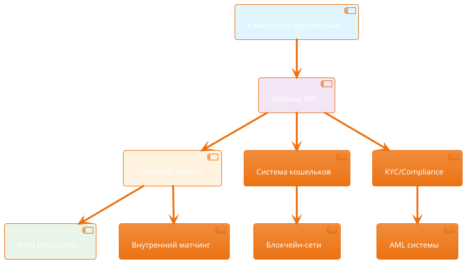

# Введение в OKD Finance

Добро пожаловать в документацию OKD Finance - профессиональной криптовалютной биржи с полной интеграцией Bybit. Эта документация предоставляет все необходимые инструменты для интеграции с нашей торговой системой.

## Что такое OKD Finance?

OKD Finance - это современная криптовалютная биржа, разработанная для профессиональной торговли цифровыми активами. Наша платформа обеспечивает:

- **Высокую производительность** - Обработка тысяч транзакций в секунду
- **Глубокую ликвидность** - Прямая интеграция с Bybit для оптимального исполнения ордеров
- **Безопасность корпоративного уровня** - Многоуровневая система безопасности
- **Полное соответствие требованиям** - KYC/AML процедуры и регулятивное соответствие

## Архитектура платформы

## Основные возможности

### 🔐 Система аутентификации
- JWT токены для безопасного доступа
- Firebase интеграция
- Двухфакторная аутентификация
- Система разрешений и ролей

### 💱 Торговые функции
- Спотовая торговля
- Маржинальная торговля
- Фьючерсные контракты
- Опционы
- Алгоритмическая торговля

### 🏦 Управление активами
- Мультивалютные кошельки
- Мгновенные депозиты и выводы
- Поддержка множества блокчейнов
- Автоматическое управление ликвидностью

### 📊 Рыночные данные
- Данные в реальном времени
- Исторические данные
- Графики и аналитика
- Агрегированные данные с Bybit

## Интеграция с Bybit

OKD Finance предоставляет прямую интеграцию с Bybit для:

- **Углубленной ликвидности** - Доступ к пулам ликвидности Bybit
- **Оптимального исполнения** - Умная маршрутизация ордеров
- **Расширенных возможностей** - Доступ к продуктам Bybit
- **Снижения рисков** - Диверсификация исполнения

## Службы API

### Gateway API
Основной API для торговли и управления аккаунтами:
- Базовый URL: `https://develop.okd.finance/api`
- Swagger: `https://develop.okd.finance/swagger/gateway/`

### Admin API
Административные функции:
- Базовый URL: `https://develop.okd.finance/admin`
- Swagger: `https://develop.okd.finance/swagger/admin/`

### External Gateway
API для внешних интеграций:
- Базовый URL: `https://develop.okd.finance/extapi`
- Swagger: `https://develop.okd.finance/swagger/extgateway/`

### Genesis API
Базовые системные операции:
- Базовый URL: `https://develop.okd.finance/genesis`
- Swagger: `https://develop.okd.finance/swagger/genesis/`

## Требования к интеграции

### Минимальные требования
- HTTPS соединение
- Валидный API ключ
- Соблюдение rate limits
- Обработка ошибок

### Рекомендуемые практики
- Использование webhook для уведомлений
- Реализация retry логики
- Логирование всех API вызовов
- Регулярное обновление токенов

## Поддержка

### Техническая поддержка
- Email: support@okd.finance
- Telegram: @okd_support
- Discord: OKD Finance Community

### Документация
- [Руководство по быстрому старту](/ru/guide/quick-start)
- [Справочник API](/ru/api/overview)
- [Примеры кода](/ru/examples/basic-usage)
- [Интеграция Bybit](/ru/bybit/overview)

### Статус системы
- Мониторинг: https://status.okd.finance
- Обновления: https://updates.okd.finance

## Следующие шаги

1. **Ознакомьтесь с быстрым стартом** - [Руководство по быстрому старту](/ru/guide/quick-start)
2. **Изучите API** - [Обзор API](/ru/api/overview)
3. **Попробуйте примеры** - [Примеры кода](/ru/examples/basic-usage)
4. **Интегрируйтесь с Bybit** - [Интеграция Bybit](/ru/bybit/overview)

::: tip Демо-окружение
Используйте демо-окружение для тестирования: `https://develop.okd.finance`
:::

::: warning Важно
Никогда не используйте продакшн API ключи в тестовой среде!
::: 