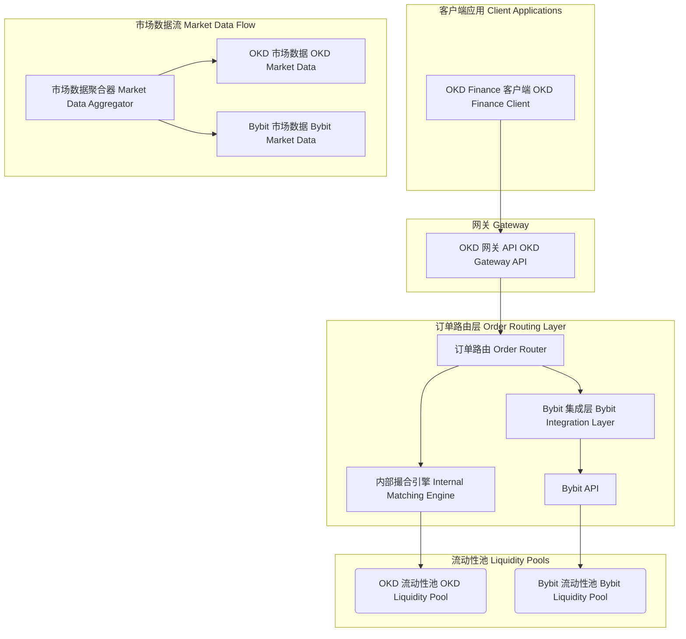

# Bybit 集成概述

本文档介绍如何通过 OKD Finance 平台集成 Bybit 交易所，实现统一的交易接口和高级功能。

## 概述

OKD Finance 提供与 Bybit 交易所的深度集成，支持现货交易、衍生品交易和高级订单类型。我们的统一 API 简化了多交易所交易的复杂性，同时保留了 Bybit 的独特功能。

## 支持的功能

### 交易类型
- **现货交易**: 支持所有主要加密货币对
- **永续合约**: USDT 和币本位永续合约
- **期货合约**: 季度和双季度期货
- **期权交易**: 即将推出
- **反向合约**: BTC 和 ETH 反向永续合约

### 订单类型
- 市价单 (Market Orders)
- 限价单 (Limit Orders)
- 止损单 (Stop Orders)
- 止损限价单 (Stop-Limit Orders)
- 条件单 (Conditional Orders)
- 冰山订单 (Iceberg Orders)
- 时间加权平均价格 (TWAP)

### 高级功能
- 统一保证金账户
- 跨保证金模式
- 对冲模式
- 一键反向
- 批量订单操作
- 实时风险管理

## 快速开始

### 1. 配置 API 密钥

```javascript
const { OKDClient } = require('okd-finance-sdk');

const client = new OKDClient({
    apiKey: 'your-okd-api-key',
    apiSecret: 'your-okd-api-secret',
    exchanges: {
        bybit: {
            apiKey: 'your-bybit-api-key',
            apiSecret: 'your-bybit-api-secret',
            testnet: false // 设置为 true 使用测试网
        }
    }
});
```

### 2. 获取账户信息

```javascript
async function getBybitAccount() {
    try {
        const account = await client.bybit.account.getInfo();
        console.log('Bybit 账户信息:', account);
        return account;
    } catch (error) {
        console.error('获取账户信息失败:', error);
    }
}
```

### 3. 下单交易

```javascript
async function placeBybitOrder() {
    const order = {
        symbol: 'BNBETH',
        side: 'buy',
        type: 'limit',
        quantity: '0.001',
        price: '43000.00',
        exchange: 'bybit',
        category: 'spot' // spot, linear, inverse, option
    };
    
    try {
        const result = await client.trading.placeOrder(order);
        console.log('订单已提交:', result);
        return result;
    } catch (error) {
        console.error('下单失败:', error);
    }
}
```

## 账户管理

### 获取余额信息

```javascript
async function getBalances() {
    try {
        // 获取现货余额
        const spotBalances = await client.bybit.account.getSpotBalances();
        console.log('现货余额:', spotBalances);
        
        // 获取合约余额
        const derivativeBalances = await client.bybit.account.getDerivativeBalances();
        console.log('合约余额:', derivativeBalances);
        
        // 获取统一保证金余额
        const unifiedBalances = await client.bybit.account.getUnifiedBalances();
        console.log('统一保证金余额:', unifiedBalances);
        
        return { spotBalances, derivativeBalances, unifiedBalances };
    } catch (error) {
        console.error('获取余额失败:', error);
    }
}
```

### 资金划转

```javascript
async function transferFunds() {
    try {
        const transfer = await client.bybit.account.transfer({
            fromAccount: 'SPOT',
            toAccount: 'CONTRACT',
            coin: 'USDT',
            amount: '100.00'
        });
        
        console.log('资金划转成功:', transfer);
        return transfer;
    } catch (error) {
        console.error('资金划转失败:', error);
    }
}
```

## 现货交易

### 现货订单管理

```javascript
class BybitSpotTrading {
    constructor(client) {
        this.client = client;
    }
    
    async placeSpotOrder(orderData) {
        const order = {
            ...orderData,
            exchange: 'bybit',
            category: 'spot'
        };
        
        return await this.client.trading.placeOrder(order);
    }
    
    async getSpotOrders(symbol) {
        return await this.client.bybit.spot.getOrders({
            symbol,
            category: 'spot'
        });
    }
    
    async cancelSpotOrder(orderId) {
        return await this.client.bybit.spot.cancelOrder({
            orderId,
            category: 'spot'
        });
    }
}

// 使用示例
const spotTrading = new BybitSpotTrading(client);

// 下限价买单
const buyOrder = await spotTrading.placeSpotOrder({
    symbol: 'BNBETH',
    side: 'buy',
    type: 'limit',
    quantity: '0.001',
    price: '43000.00'
});
```

## 衍生品交易

### 永续合约交易

```javascript
class BybitDerivativeTrading {
    constructor(client) {
        this.client = client;
    }
    
    async placePerpetualOrder(orderData) {
        const order = {
            ...orderData,
            exchange: 'bybit',
            category: 'linear' // linear, inverse
        };
        
        return await this.client.trading.placeOrder(order);
    }
    
    async setLeverage(symbol, leverage) {
        return await this.client.bybit.derivatives.setLeverage({
            symbol,
            leverage,
            category: 'linear'
        });
    }
    
    async getPositions(symbol) {
        return await this.client.bybit.derivatives.getPositions({
            symbol,
            category: 'linear'
        });
    }
    
    async closePosition(symbol) {
        const position = await this.getPositions(symbol);
        if (position && position.size > 0) {
            return await this.placePerpetualOrder({
                symbol,
                side: position.side === 'buy' ? 'sell' : 'buy',
                type: 'market',
                quantity: position.size,
                reduceOnly: true
            });
        }
    }
}

// 使用示例
const derivativeTrading = new BybitDerivativeTrading(client);

// 设置杠杆
await derivativeTrading.setLeverage('BNBETH', 10);

// 开多仓
const longOrder = await derivativeTrading.placePerpetualOrder({
    symbol: 'BNBETH',
    side: 'buy',
    type: 'market',
    quantity: '0.01'
});
```

## 市场数据

### 实时价格数据

```javascript
class BybitMarketData {
    constructor(client) {
        this.client = client;
        this.ws = null;
    }
    
    async getTicker(symbol, category = 'spot') {
        return await this.client.bybit.market.getTicker({
            symbol,
            category
        });
    }
    
    async getOrderBook(symbol, limit = 25) {
        return await this.client.bybit.market.getOrderBook({
            symbol,
            limit,
            category: 'spot'
        });
    }
    
    async getKlines(symbol, interval, limit = 200) {
        return await this.client.bybit.market.getKlines({
            symbol,
            interval, // 1, 3, 5, 15, 30, 60, 120, 240, 360, 720, D, W, M
            limit,
            category: 'spot'
        });
    }
    
    connectWebSocket() {
        this.ws = new WebSocket('wss://api.okd.finance/v1/ws/bybit');
        
        this.ws.onopen = () => {
            console.log('Bybit WebSocket 连接已建立');
            this.subscribeToChannels();
        };
        
        this.ws.onmessage = (event) => {
            const data = JSON.parse(event.data);
            this.handleMessage(data);
        };
    }
    
    subscribeToChannels() {
        const subscriptions = [
            'orderbook.1.BNBETH',
            'publicTrade.BNBETH',
            'tickers.BNBETH'
        ];
        
        this.ws.send(JSON.stringify({
            method: 'subscribe',
            params: {
                exchange: 'bybit',
                channels: subscriptions
            }
        }));
    }
    
    handleMessage(data) {
        switch(data.topic) {
            case 'orderbook':
                this.onOrderBookUpdate(data);
                break;
            case 'publicTrade':
                this.onTradeUpdate(data);
                break;
            case 'tickers':
                this.onTickerUpdate(data);
                break;
        }
    }
    
    onOrderBookUpdate(data) {
        console.log('订单簿更新:', data);
    }
    
    onTradeUpdate(data) {
        console.log('交易更新:', data);
    }
    
    onTickerUpdate(data) {
        console.log('价格更新:', data);
    }
}

// 使用示例
const marketData = new BybitMarketData(client);
marketData.connectWebSocket();
```

## 风险管理

### 仓位风险控制

```javascript
class BybitRiskManager {
    constructor(client, config) {
        this.client = client;
        this.config = {
            maxPositionSize: config.maxPositionSize || 1000, // USDT
            maxLeverage: config.maxLeverage || 10,
            stopLossPercent: config.stopLossPercent || 0.05, // 5%
            takeProfitPercent: config.takeProfitPercent || 0.10 // 10%
        };
    }
    
    async checkRiskBeforeOrder(orderData) {
        const account = await this.client.bybit.account.getInfo();
        const positions = await this.client.bybit.derivatives.getPositions();
        
        // 检查账户余额
        if (account.totalWalletBalance < orderData.quantity * orderData.price) {
            throw new Error('账户余额不足');
        }
        
        // 检查仓位大小
        const currentPositionValue = this.calculateTotalPositionValue(positions);
        const newPositionValue = orderData.quantity * orderData.price;
        
        if (currentPositionValue + newPositionValue > this.config.maxPositionSize) {
            throw new Error('超过最大仓位限制');
        }
        
        return true;
    }
    
    calculateTotalPositionValue(positions) {
        return positions.reduce((total, position) => {
            return total + Math.abs(position.size * position.markPrice);
        }, 0);
    }
    
    async setStopLossAndTakeProfit(symbol, entryPrice, side) {
        const stopLossPrice = side === 'buy' 
            ? entryPrice * (1 - this.config.stopLossPercent)
            : entryPrice * (1 + this.config.stopLossPercent);
            
        const takeProfitPrice = side === 'buy'
            ? entryPrice * (1 + this.config.takeProfitPercent)
            : entryPrice * (1 - this.config.takeProfitPercent);
        
        // 设置止损单
        await this.client.trading.placeOrder({
            symbol,
            side: side === 'buy' ? 'sell' : 'buy',
            type: 'stop',
            stopPrice: stopLossPrice.toFixed(2),
            exchange: 'bybit',
            category: 'linear',
            reduceOnly: true
        });
        
        // 设置止盈单
        await this.client.trading.placeOrder({
            symbol,
            side: side === 'buy' ? 'sell' : 'buy',
            type: 'limit',
            price: takeProfitPrice.toFixed(2),
```mermaid
 
subgraph "客户端应用 Client Applications"
     A["OKD Finance 客户端 OKD Finance Client"]
 end
 
subgraph "网关 Gateway"
     B["OKD 网关 API OKD Gateway API"]
 end
 
subgraph "订单路由层 Order Routing Layer"
     C["订单路由 Order Router"]
     D["内部撮合引擎 Internal Matching Engine"]
     E["Bybit 集成层 Bybit Integration Layer"]
     F["Bybit API"]
 end
 
subgraph "流动性池 Liquidity Pools"
     G(OKD 流动性池 OKD Liquidity Pool)
     H(Bybit 流动性池 Bybit Liquidity Pool)
 end
 
subgraph "市场数据流 Market Data Flow"
     I["市场数据聚合器 Market Data Aggregator"]
     J["OKD 市场数据 OKD Market Data"]
     K["Bybit 市场数据 Bybit Market Data"]
 end
 
A --> B
B --> C
C --> D
C --> E
E --> F
D --> G
F --> H
I --> J
I --> K
```
async function placeConditionalOrder() {
    const conditionalOrder = {
        symbol: 'BNBETH',
        side: 'buy',
        type: 'limit',
        quantity: '0.001',
        price: '42000.00',
        triggerPrice: '43000.00',
        triggerBy: 'LastPrice',
        exchange: 'bybit',
        category: 'linear'
    };
    
    try {
        const result = await client.bybit.trading.placeConditionalOrder(conditionalOrder);
        console.log('条件订单已提交:', result);
        return result;
    } catch (error) {
        console.error('条件订单失败:', error);
    }
}
```

## 错误处理

### Bybit 特定错误

```javascript
class BybitErrorHandler {
    static handle(error) {
        const bybitErrors = {
            10001: 'API 密钥无效',
            10002: '签名验证失败',
            10003: 'API 密钥权限不足',
            10004: '请求频率过高',
            10005: 'IP 地址未在白名单中',
            20001: '订单不存在',
            20002: '余额不足',
            20003: '仓位不存在',
            20004: '价格超出限制',
            20005: '数量超出限制'
        };
        
        if (error.code && bybitErrors[error.code]) {
            console.error(`Bybit 错误 ${error.code}: ${bybitErrors[error.code]}`);
        } else {
            console.error('未知 Bybit 错误:', error);
        }
    }
}
```

## 性能优化

### 连接池管理

```javascript
class BybitConnectionManager {
    constructor() {
        this.connections = new Map();
        this.maxConnections = 5;
    }
    
    getConnection(type) {
        if (!this.connections.has(type)) {
            this.connections.set(type, this.createConnection(type));
        }
        return this.connections.get(type);
    }
    
    createConnection(type) {
        const wsUrl = type === 'public' 
            ? 'wss://api.okd.finance/v1/ws/bybit/public'
            : 'wss://api.okd.finance/v1/ws/bybit/private';
            
        return new WebSocket(wsUrl);
    }
    
    closeAllConnections() {
        this.connections.forEach(ws => ws.close());
        this.connections.clear();
    }
}
```

## 监控和日志

### 交易监控

```javascript
class BybitMonitor {
    constructor(client) {
        this.client = client;
        this.metrics = {
            totalTrades: 0,
            totalVolume: 0,
            successRate: 0,
            avgLatency: 0
        };
    }
    
    async startMonitoring() {
        setInterval(async () => {
            await this.checkAccountHealth();
            await this.checkPositionRisk();
            await this.logMetrics();
        }, 30000); // 每30秒检查一次
    }
    
    async checkAccountHealth() {
        try {
            const account = await this.client.bybit.account.getInfo();
            
            if (account.totalWalletBalance < 100) {
                console.warn('账户余额过低:', account.totalWalletBalance);
            }
            
            if (account.totalUnrealizedPnl < -500) {
                console.warn('未实现亏损过大:', account.totalUnrealizedPnl);
            }
        } catch (error) {
            console.error('账户健康检查失败:', error);
        }
    }
    
    async checkPositionRisk() {
        try {
            const positions = await this.client.bybit.derivatives.getPositions();
            
            positions.forEach(position => {
                if (Math.abs(position.unrealizedPnl) > 100) {
                    console.warn(`仓位 ${position.symbol} 未实现盈亏过大:`, position.unrealizedPnl);
                }
            });
        } catch (error) {
            console.error('仓位风险检查失败:', error);
        }
    }
    
    logMetrics() {
        console.log('交易指标:', this.metrics);
    }
}
```

## 最佳实践

### 1. API 密钥安全
- 使用环境变量存储 API 密钥
- 定期轮换 API 密钥
- 设置 IP 白名单
- 限制 API 权限范围

### 2. 风险管理
- 设置止损和止盈
- 控制仓位大小
- 分散投资风险
- 定期评估策略表现

### 3. 性能优化
- 使用 WebSocket 获取实时数据
- 实现连接池管理
- 缓存频繁访问的数据
- 批量处理订单操作

### 4. 错误处理
- 实现重试机制
- 记录详细日志
- 监控系统健康状态
- 设置告警机制

## 技术支持

如需技术支持和咨询：
- 文档：[https://docs.okd.finance](https://docs.okd.finance)
- 支持：support@okd.finance
- GitHub：[https://github.com/OKD-Finance/Backend](https://github.com/OKD-Finance/Backend)
- Bybit 官方文档：[https://bybit-exchange.github.io/docs/](https://bybit-exchange.github.io/docs/)

## 架构集成架构


